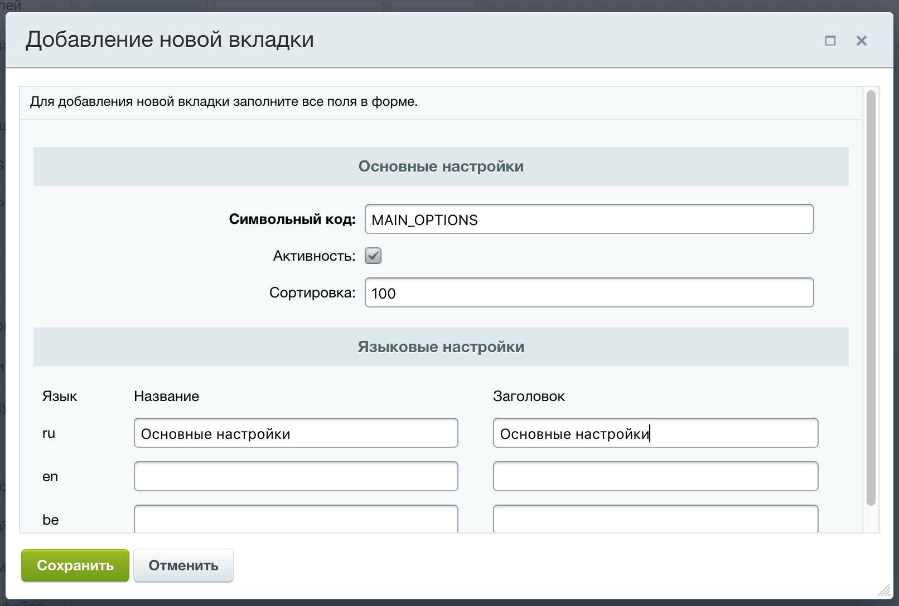
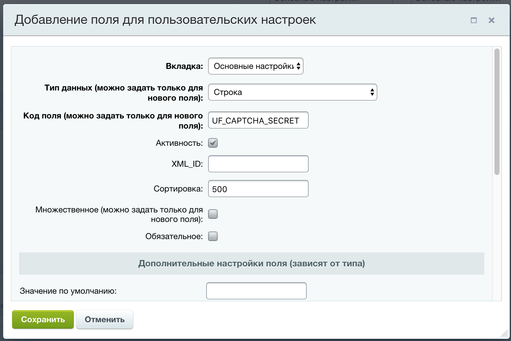
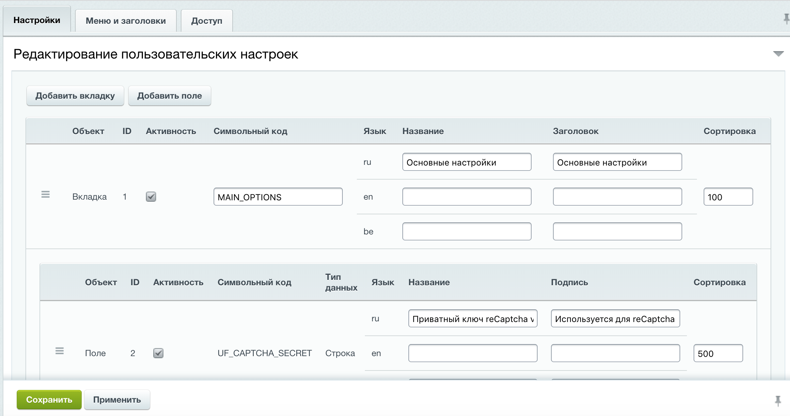
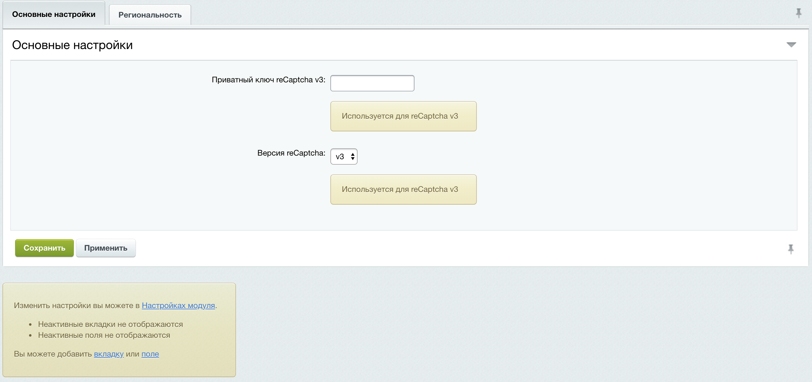
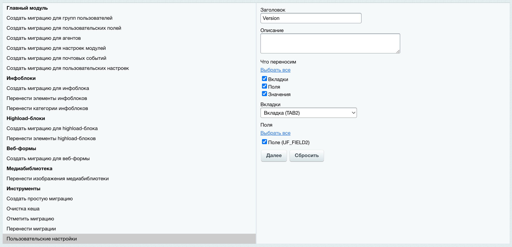

# Модуль 1С-Битрикс "Пользовательские настройки"

[![Latest Version][badge-release]][packagist]
[![Software License][badge-license]][license]
[![PHP Version][badge-php]][php]
[![Total Downloads][badge-downloads]][downloads]

Позволяет создать административную страницу с пользовательскими настройками.
Предоставляет удобное API для создания вкладок и полей, что дает возможность
использовать этот модуль совместно с модулями миграций. События дают возможность вносить
изменения в устанавливаемое значение настройки или выполнить какие-либо действия при
добавлении/удалении/обновлении вкладок или полей.

## Описание модуля

Данный модуль решает задачи добавления настроек для вашего проекта.
Например: включение/отключение, даты для реализации активности какого-либо функционала,
тексты. Типы полей в настройках ограничены типами пользовательских полей, т.е. вы легко можете
добавить свой тип поля для настроек.

## Преимущества модуля

1. Расположение ссылки в меню со страницей пользовательских настроек можно расположить в любом основном разделе. Также возможна настройка названия страницы и название ссылки пользовательских настроек;
1. В настройках модуля можно добавить вкладки и в них поля;
1. Для вкладок и полей предусмотрена сортировка, что позволяет настроить расположение их на странице пользовательских настроек;
1. В качестве полей модуля выступают пользовательские поля, что позволяет добавить в настройки любой из доступных типов пользовательских полей (строка, дата и т.д.);
1. Поддерживаются множественные значения для настроек;
1. Предусмотрены гибкие настройки прав доступа для просмотра/редактирования пользовательских настроек и просмотра/редактирования полей, вкладок;
1. Для вкладок есть возможность указать название и заголовок, для полей - название и подсказку;
1. Используя API легко можно добавить вкладку или поле, это позволяет писать миграции;
1. Система событий дает возможность вносить изменения при установке значения настройки или выполнить какие-либо действия при добавлении/удалении/обновлении вкладок или полей.

## Список поддерживаемых типов полей

Из коробки вам будут доступны следующие типы полей:

- Адрес;
- Бронирование ресурсов;
- Видео;
- Да/Нет;
- Дата;
- Дата со временем;
- Деньги;
- Опрос;
- Письмо (email);
- Привязка к разделам инф. блоков;
- Привязка к элементам highload-блоков;
- Привязка к элементам инф. блоков;
- Содержимое ссылки;
- Список;
- Ссылка;
- Строка;
- Файл;
- Целое число;
- Число;
- Шаблон.

*список актуален на момент релиза модуля для «1С-Битрикс: Управление сайтом» редакции "Бизнес"*

## Изображения модуля

Добавление новой вкладки:



Добавление поля для пользовательских настроек:



Редактирование пользовательских настроек



Внешний вид пользовательских настроек



## Установка модуля

В вашем composer.json проекта необходимо указать:

- в блоке require указать инсталятор ```"composer/installers": "~1.0"```;
- в блоке require указать модуль "fi1a/usersettings": ">=1.2.0 <1.3.0";
- указать путь для копирования модулей при установке ```composer/installers```.

Пример файла composer.json проекта:

```json
{
  "name": "fi1a/project",
  "type": "project",
  "license": "MIT",
  "authors": [
    {
      "name": "Fi1a",
      "email": "fi1a@icloud.com"
    }
  ],
  "require": {
    "composer/installers": "~1.0",
    "fi1a/usersettings": ">=1.2.0 <1.3.0"
  },
  "extra": {
    "installer-paths": {
      "modules/{$vendor}.{$name}/": ["type:bitrix-d7-module"]
    }
  }
}
```

Если у вас не подключен composer autoload.php, его необходимо подключить в файле local/php_interface/init.php

```php
require_once __DIR__ . '/../vendor/autoload.php';
```

Затем выполняем установку пакетов командой ```composer install``` и устанавливаем модуль из админки 1С-Битрикс
(Marketplace > Установленные решения модуль "Пользовательские настройки (fi1a.usersettings)").

## Поддержка миграций

Начиная с версии 1.2.0 появилась поддержка миграций модуля ["Миграции для разработчиков" (sprint.migration)](https://marketplace.1c-bitrix.ru/solutions/sprint.migration/)

Добавлен хелпер ```\Fi1a\UserSettings\SprintMigration\Helpers\UserSettingsHelper``` и билдер ```\Fi1a\UserSettings\SprintMigration\Builders\UserSettingsBuilder```

Использование хелпера:

```php
public function up()
{
    $helper = $this->getHelperManager();

    $helper->UserSettings()->saveTab("TAB", array (
        'ACTIVE' => '1',
        'CODE' => 'TAB',
        'SORT' => '500',
        'LOCALIZATION' => [
            'ru' => [
                'L_NAME' => 'Вкладка',
                'L_TITLE' => 'Вкладка',
            ],
            'en' => [
                'L_NAME' => 'Tab',
                'L_TITLE' => 'Tab',
            ],
        ],
    ));
}
```

Создание миграции доступно в разделе "Инструменты" под пунктом "Пользовательские настройки" на странице управления
миграциями модуля "Миграции для разработчиков" (sprint.migration).



## Работа со значениями полей

Класс ```\Fi1a\UserSettings\Option``` предназначен для работы со значениями полей.
Класс реализует паттерн Singleton и для получения экземпляра класса следует использовать
метод ```getInstance()```.

```php
use \Bitrix\Main\Loader;
use \Fi1a\UserSettings\Option;

Loader::includeModule('fi1a.usersettings');

$option = Option::getInstance();
```

### Получить значение поля

Для получения значения поля по символьному коду необходимо
воспользоваться методом ```get(string $key, $default = null)```.

| Аргумент | Описание
------ | ------
| string $key | Символьный код поля
| $default | Значение, которое вернется при отсутсвии значения в БД

```php
use \Bitrix\Main\Loader;
use \Fi1a\UserSettings\Option;

Loader::includeModule('fi1a.usersettings');

// Вернется значение поля UF_CAPTCHA_SECRET, если значение не задано вернется false
Option::getInstance()->get('UF_CAPTCHA_SECRET', false);
```
Метод ```getAll(): array``` предназначен для получения значений
по всем пользовательским полям.

```php
use \Bitrix\Main\Loader;
use \Fi1a\UserSettings\Option;

Loader::includeModule('fi1a.usersettings');

// Вернутся значения по всем пользовательским полям
Option::getInstance()->getAll();
```

### Установить значение поля

Для установки значения поля используется метод ```set(string $key, $value): \Bitrix\Main\Result```.
В этом методе реализована валидация значения поля. Метод возвращает экземпляр класса
```\Bitrix\Main\Result``` и проверить наличие ошибки при установке значения можно
методом ```isSuccess()```.

| Аргумент | Описание
------ | ------
| string $key | Символьный код поля
| $value | Новое значение поля

```php
use \Bitrix\Main\Loader;
use \Fi1a\UserSettings\Option;

Loader::includeModule('fi1a.usersettings');

$option = Option::getInstance();

$result = $option->set('UF_CAPTCHA_SECRET', 'foo');
if (!$result->isSuccess()) {
    // В случае ошибки
    echo implode('&lt;br&gt;', $result->getErrorMessages());

    return;
}

// Вернется значение "foo" установленное методом "set"
$option->get('UF_CAPTCHA_SECRET');
```

### Сбросить кеш значений

При изменении структуры или установки значения кеш автоматически очищается.
Метод ```clearCache(): bool``` пригодится для принудительной очистки кеша
при изменениях не через API модуля.

```php
use \Bitrix\Main\Loader;
use \Fi1a\UserSettings\Option;

Loader::includeModule('fi1a.usersettings');

Option::getInstance()->clearCache();
```

## Выборка, добавление, обновление, удаление вкладок

Работа с вкладками реализуется тремя классами:

- ```\Fi1a\UserSettings\TabMapper``` &mdash; маппер вкладок пользовательских настроек;
- ```\Fi1a\UserSettings\Tab``` &mdash; класс вкладки в пользовательских настройках;
- ```\Fi1a\UserSettings\TabCollection``` &mdash; коллекция экземпляров классов вкладок пользовательских настроек.

Подробнее на них остановимся ниже.

### Добавление вкладки

Класс вкладки ```\Fi1a\UserSettings\Tab``` является наследником класса
```\ArrayObject```. Для начала нужно получить экземпляр класса вкладки используя
фабричный метод ```create(array $input = []): ITab``` передав в него все необходимые
парамеры. Данный метод является статичным. После того как мы получили экземпляр
класса ```\Fi1a\UserSettings\Tab``` вызовем метод ```add(): AddResult```,
который вернет результат в виде объкта класса ```\Bitrix\Main\ORM\Data\AddResult```.
Успешность выполнения операции можно проверить методом ```isSuccess($internalCall = false)```
класса ```\Bitrix\Main\ORM\Data\AddResult```.

```php
use \Bitrix\Main\Loader;
use \Fi1a\UserSettings\Tab;

Loader::includeModule('fi1a.usersettings');

$tab = Tab::create([
    'ACTIVE' => 1,
    'CODE' => 'FORM_OPTIONS',
    'SORT' => 500,
    'LOCALIZATION' => [
        'ru' => [
            'L_NAME' => 'Настройки формы',
            'L_TITLE' => 'Важные настройки формы',
        ],
    ],
]);

$addResult = $tab->add();
if (!$addResult->isSuccess()) {
    echo implode('&lt;br&gt;', $addResult->getErrorMessages());
}
```

Описание полей:

- ```ACTIVE``` &mdash; активность вкладки. Определяет будет ли выведена вкладка на странице пользовательских настроек;
- ```CODE``` &mdash; символьный код вкладки;
- ```SORT``` &mdash; сортировка вкладки. Определяет в какой последовательности будут выведены вкладки на странице пользовательских настроек;
- ```LOCALIZATION``` &mdash; массив с языковыми сообщениями. Ключем является символьный код языка.
    - ```L_NAME``` &mdash; название вкладки;
    - ```L_TITLE``` &mdash; заголовок вкладки.
    
### Выборка вкладок

Основным метод для выборки вкладок является метод
```getList(array $parameters = []): ITabCollection```
класса ```\Fi1a\UserSettings\TabMapper```. Данный метод принимает в качестве аргумента
массив аналогичный синтаксису ORM D7. Метод возвращает коллекцию классов вкладок
```\Fi1a\UserSettings\TabCollection```. При пустом результате выборки
класс коллекции вернется с нулевым количеством элементов.

| Аргумент | Описание
------ | ------
| array $parameters | Параметры getList

```php
use \Bitrix\Main\Loader;
use \Fi1a\UserSettings\TabMapper;

Loader::includeModule('fi1a.usersettings');

$tabCollection = TabMapper::getList([
    'filter' => [
        'ACTIVE' => 1,
    ],
    'order' => [
        'SORT' => 'ASC',
    ],
]);

foreach ($tabCollection as $tab) {
    // Do something
}
unset($tab);
```

Предыдущий пример можно заменить с использованием метода
```getActive(array $parameters = []): ITabCollection```. Данный метод
выполняет выборку всех активных вкладок с возможностью дополнительной фильтрации или сортировки путем
передачи аргумента ```$parameters``` аналогичного ORM D7.

| Аргумент | Описание
------ | ------
| array $parameters | Параметры getList

```php
use \Bitrix\Main\Loader;
use \Fi1a\UserSettings\TabMapper;

Loader::includeModule('fi1a.usersettings');

$tabCollection = TabMapper::getActive([
    'order' => [
        'SORT' => 'ASC',
    ],
]);

foreach ($tabCollection as $tab) {
    // Do something
}
unset($tab);
```

Метод ```getById(int $id)``` осуществляет поиск вкладки по идентификатору. В отличие от
методов ```getList(array $parameters = []): ITabCollection``` и ```getActive(array $parameters = []): ITabCollection```
возвращает не коллекцию вкладок, а экземпляр класса вкладки ```\Fi1a\UserSettings\Tab```.
Если вкладку не удалось найти по идентификатору, метод вернет значение ```false```.

| Аргумент | Описание
------ | ------
| int $id | Идентификатор вкладки

```php
use \Bitrix\Main\Loader;
use \Fi1a\UserSettings\TabMapper;

Loader::includeModule('fi1a.usersettings');

$tab = TabMapper::getById(1);

if (false !== $tab) {
    echo $tab['ID'];
}
```

### Обновление вкладки

Для обновления вкладки следует использовать метод ```update(): UpdateResult```
класса ```\Fi1a\UserSettings\Tab```,
который вернет результат в виде объкта класса ```\Bitrix\Main\ORM\Data\UpdateResult```.
Успешность выполнения операции можно проверить методом ```isSuccess($internalCall = false)```
класса ```\Bitrix\Main\ORM\Data\UpdateResult```.

```php
use \Bitrix\Main\Loader;
use \Fi1a\UserSettings\TabMapper;

Loader::includeModule('fi1a.usersettings');

$tab = TabMapper::getById(3);

if (false !== $tab) {
    $tab['ACTIVE'] = 0;

    $updateResult = $tab->update();

    if (!$updateResult->isSuccess()) {
        echo implode('&lt;br&gt;', $updateResult->getErrorMessages());
    }
}
```

### Сохранение вкладки

Метод ```save()``` осуществляет добавление или обновление вкладки в зависимости от
наличия значения ```ID``` (первичного ключа).

Обновление с использованием метода ```save()```

```php
use \Bitrix\Main\Loader;
use \Fi1a\UserSettings\TabMapper;

Loader::includeModule('fi1a.usersettings');

$tab = TabMapper::getById(3);

if (false !== $tab) {
    // Вызов метода обновит вкладку
    $tab['ACTIVE'] = 1;

    $updateResult = $tab->save();

    if (!$updateResult->isSuccess()) {
        echo implode('&lt;br&gt;', $updateResult->getErrorMessages());
    }
}
```

Добавление с использованием метода ```save()```

```php
use \Bitrix\Main\Loader;
use \Fi1a\UserSettings\TabMapper;

Loader::includeModule('fi1a.usersettings');

$tab = TabMapper::getById(3);

if (false !== $tab) {
    // Вызов метода добавит вкладку
    unset($tab['ID']);
    $tab['CODE'] = 'NEW_TAB_CODE';

    $addResult = $tab->save();

    if (!$addResult->isSuccess()) {
        echo implode('&lt;br&gt;', $addResult->getErrorMessages());
    }
}
```

### Удаление вкладки

Для удаления вкладки следует использовать метод ```delete(): DeleteResult```
класса ```\Fi1a\UserSettings\Tab```,
который вернет результат в виде объкта класса ```\Bitrix\Main\ORM\Data\DeleteResult```.
Успешность выполнения операции можно проверить методом ```isSuccess($internalCall = false)```
класса ```\Bitrix\Main\ORM\Data\DeleteResult```.

```php
use \Bitrix\Main\Loader;
use \Fi1a\UserSettings\TabMapper;

Loader::includeModule('fi1a.usersettings');

$tab = TabMapper::getById(3);

$deleteResult = $tab->delete();

if (!$deleteResult->isSuccess()) {
    echo implode('&lt;br&gt;', $deleteResult->getErrorMessages());
}
```

## Выборка, добавление, обновление, удаление полей

Работа с полями реализуется тремя классами:

- ```\Fi1a\UserSettings\FieldMapper``` &mdash; маппер полей пользовательских настроек;
- ```\Fi1a\UserSettings\Field``` &mdash; класс поля пользовательских настройках;
- ```\Fi1a\UserSettings\FieldCollection``` &mdash; коллекция экземпляров классов полей пользовательских настроек.

Подробнее на них остановимся ниже.

### Добавление поля

Класс поля ```\Fi1a\UserSettings\Field``` является наследником класса
```\ArrayObject```. Для начала нужно получить экземпляр класса поля, используя
фабричный метод ```create(array $input = []): IField```, передав в него все необходимые
парамеры. Данный метод является статичным. После того как мы получили экземпляр
класса ```\Fi1a\UserSettings\Field``` вызовем метод ```add(): AddResult```,
который вернет результат в виде объкта класса ```\Bitrix\Main\ORM\Data\AddResult```.
Успешность выполнения операции можно проверить методом ```isSuccess($internalCall = false)```
класса ```\Bitrix\Main\ORM\Data\AddResult```.

Ниже приведен пример добавления поля с типом строка.

```php
use \Bitrix\Main\Loader;
use \Fi1a\UserSettings\Field;

Loader::includeModule('fi1a.usersettings');

$field = Field::create([
    'ACTIVE' => '1',
    'TAB_ID' => '1',
    'UF' => [
        'FIELD_NAME' => 'UF_RECAPTCHA_SECRET',
        'USER_TYPE_ID' => 'string',
        'XML_ID' => '',
        'SORT' => '500',
        'MULTIPLE' => 'N',
        'MANDATORY' => 'N',
        'SETTINGS' => [
            'SIZE' => 60,
            'ROWS' => 1,
            'REGEXP' => '',
            'MIN_LENGTH' => 0,
            'MAX_LENGTH' => 0,
            'DEFAULT_VALUE' => '',
        ],
        'EDIT_FORM_LABEL' => ['en' => '', 'ru' => 'Приватный ключ reСaptcha v3',],
        'HELP_MESSAGE' => ['en' => '', 'ru' => 'Используется для reСaptcha v3',],
    ],
]);

$addResult = $field->add();

if (!$addResult->isSuccess()) {
    echo implode('&lt;br&gt;', $addResult->getErrorMessages());
}
```

Описание полей:

- ```ACTIVE``` &mdash; активность поля. Определяет будет ли выведено поле на странице пользовательских настроек;
- ```TAB_ID``` &mdash; идентификатор вкладки, которой принадлежит поле;
- ```UF``` &mdash; массив с настройками пользовательского поля.

### Выборка полей

Основным методом для выборки полей является
```getList(array $parameters = []): IFieldCollection```
класса ```\Fi1a\UserSettings\FieldMapper```. Данный метод принимает в качестве аргумента
массив аналогичный синтаксису ORM D7. Метод возвращает коллекцию классов полей
```\Fi1a\UserSettings\FieldCollection```. При пустом результате выборки
класс коллекции вернется с нулевым количеством элементов.

| Аргумент | Описание
------ | ------
| array $parameters | Параметры getList

```php
use \Bitrix\Main\Loader;
use \Fi1a\UserSettings\FieldMapper;

Loader::includeModule('fi1a.usersettings');

$fieldCollection = FieldMapper::getList([
    'filter' => [
        'ACTIVE' => 1,
    ],
    'order' => [
        'ID' => 'DESC',
    ],
]);

foreach ($fieldCollection as $field) {
    // Do something
}
unset($field);
```

Предыдущий пример можно заменить с использованием метода
```getActive(array $parameters = []): IFieldCollection```. Данный метод
выполняет выборку всех активных полей с возможностью дополнительной фильтрации или сортировки путем
передачи аргумента ```$parameters``` аналогичного ORM D7.

| Аргумент | Описание
------ | ------
| array $parameters | Параметры getList

```php
use \Bitrix\Main\Loader;
use \Fi1a\UserSettings\FieldMapper;

Loader::includeModule('fi1a.usersettings');

$fieldCollection = FieldMapper::getActive([
    'order' => [
        'ID' => 'DESC',
    ],
]);

foreach ($fieldCollection as $field) {
    // Do something
}
unset($field);
```

Метод ```getById(int $id)``` осуществляет поиск поля по идентификатору (не по идентификатору пользовательского поля).
В отличие от методов ```getList(array $parameters = []): IFieldCollection``` и ```getActive(array $parameters = []): IFieldCollection```
возвращает не коллекцию полей, а экземпляр класса поля ```\Fi1a\UserSettings\Field```.
Если поле не удалось найти по идентификатору, метод вернет значение ```false```.

| Аргумент | Описание
------ | ------
| int $id | Идентификатор поля

```php
use \Bitrix\Main\Loader;
use \Fi1a\UserSettings\FieldMapper;

Loader::includeModule('fi1a.usersettings');

$field = FieldMapper::getById(2);

if (false !== $field) {
    echo $field['ID'];
}
```

Для выбора всех полей вкладки можно использовать метод ```getByTabId(int $tabId)```.
Метод вернет коллекцию полей принадлежащих вкладки с идентификатором ```int $tabId```.

| Аргумент | Описание
------ | ------
| int $tabId | Идентификатор вкладки поля

```php
use \Bitrix\Main\Loader;
use \Fi1a\UserSettings\FieldMapper;

Loader::includeModule('fi1a.usersettings');

$fieldCollection = FieldMapper::getByTabId(1);

foreach ($fieldCollection as $field) {
    // Do something
}
unset($field);
```

### Обновление поля

Для обновления поля следует использовать метод ```update(): UpdateResult```
класса ```\Fi1a\UserSettings\Field```,
который вернет результат в виде объекта класса ```\Bitrix\Main\ORM\Data\UpdateResult```.
Успешность выполнения операции можно проверить методом ```isSuccess($internalCall = false)```
класса ```\Bitrix\Main\ORM\Data\UpdateResult```.

```php
use \Bitrix\Main\Loader;
use \Fi1a\UserSettings\FieldMapper;

Loader::includeModule('fi1a.usersettings');

$field = FieldMapper::getById(3);

if (false !== $field) {
    $field['ACTIVE'] = 0;

    $updateResult = $field->update();

    if (!$updateResult->isSuccess()) {
        echo implode('&lt;br&gt;', $updateResult->getErrorMessages());
    }
}
```

### Сохранение поля

Метод ```save()``` осуществляет добавление или обновление поля в зависимости от
наличия значения ```ID``` (первичного ключа).

Обновление с использованием метода ```save()```

```php
use \Bitrix\Main\Loader;
use \Fi1a\UserSettings\FieldMapper;

Loader::includeModule('fi1a.usersettings');

$field = FieldMapper::getById(3);

if (false !== $field) {
    // Вызов метода обновит поле
    $field['ACTIVE'] = 1;

    $updateResult = $field->save();

    if (!$updateResult->isSuccess()) {
        echo implode('&lt;br&gt;', $updateResult->getErrorMessages());
    }
}
```

Добавление с использованием метода ```save()```

```php
use \Bitrix\Main\Loader;
use \Fi1a\UserSettings\FieldMapper;

Loader::includeModule('fi1a.usersettings');

$field = FieldMapper::getById(3);

if (false !== $field) {
    // Вызов метода добавит поле
    unset($field['ID']);
    unset($field['UF_ID']);
    unset($field['UF']['ID']);
    $field['UF']['FIELD_NAME'] = 'UF_NEW_FIELD';

    $addResult = $field->save();

    if (!$addResult->isSuccess()) {
        echo implode('&lt;br&gt;', $addResult->getErrorMessages());
    }
}
```

### Удаление поля

Для удаления поля следует использовать метод ```delete(): DeleteResult```
класса ```\Fi1a\UserSettings\Field```,
который вернет результат в виде объкта класса ```\Bitrix\Main\ORM\Data\DeleteResult```>.
Успешность выполнения операции можно проверить методом ```isSuccess($internalCall = false)```
класса ```\Bitrix\Main\ORM\Data\DeleteResult```.

```php
use \Bitrix\Main\Loader;
use \Fi1a\UserSettings\FieldMapper;

Loader::includeModule('fi1a.usersettings');

$field = FieldMapper::getById(3);

$deleteResult = $field->delete();

if (!$deleteResult->isSuccess()) {
    echo implode('&lt;br&gt;', $deleteResult->getErrorMessages());
}
```

## События модуля

В модуле предусмотрены события, которые позволяют модифицировать данные или расширить функционал модуля.
Пример использования событий:

```php
use \Bitrix\Main\Event;
use \Bitrix\Main\Loader;
use \Bitrix\Main\EventManager;
use \Bitrix\Main\EventResult;
use \Fi1a\UserSettings\Option;

Loader::includeModule('fi1a.usersettings');

EventManager::getInstance()->addEventHandler(
    'fi1a.usersettings',
    'OnOptionGet',
    function (Event $event) {
        return new EventResult(
            EventResult::SUCCESS,
            [
                'default' => 'new default value',
            ]
        );
    }
);

// Если поле имеет значение null или false, вместо 'foo' вернется значение 'new default value'
Option::getInstance()->get('UF_RECAPCHA_SECRET', 'foo');
```
### События связанные со значениями полей

- ```OnOptionGet``` &mdash; вызывается ДО возврата значения поля методом ```get(string $key, $default = null)``` класса ```\Fi1a\UserSettings\Option```;
- ```OnBeforeOptionSet``` &mdash; вызывается ДО установки значения поля методом ```set(string $key, $value): Result``` класса ```\Fi1a\UserSettings\Option```;
- ```OnAfterOptionSet``` &mdash; вызывается ПОСЛЕ установки значения поля методом ```set(string $key, $value): Result``` класса ```\Fi1a\UserSettings\Option```.


### События связанные с вкладками

- ```OnBeforeTabAdd``` &mdash; вызывается ДО добавления новой вкладки методом ```add(): AddResult``` класса ```\Fi1a\UserSettings\Tab```;
- ```OnAfterTabAdd``` &mdash; вызывается ПОСЛЕ добавления новой вкладки методом ```add(): AddResult``` класса ```\Fi1a\UserSettings\Tab```;
- ```OnBeforeTabUpdate``` &mdash; вызывается ДО обновления вкладки методом ```update(): UpdateResult``` класса ```\Fi1a\UserSettings\Tab```;
- ```OnAfterTabUpdate``` &mdash; вызывается ПОСЛЕ обновления вкладки методом ```update(): UpdateResult``` класса ```\Fi1a\UserSettings\Tab```;
- ```OnBeforeTabDelete``` &mdash; вызывается ДО удаления вкладки методом ```delete(): DeleteResult``` класса ```\Fi1a\UserSettings\Tab```;
- ```OnAfterTabDelete``` &mdash; вызывается ПОСЛЕ удаления вкладки методом ```delete(): DeleteResult``` класса ```\Fi1a\UserSettings\Tab```.

### События связанные с полями

- ```OnBeforeFieldAdd``` &mdash; вызывается ДО добавления нового поля методом ```add(): AddResult``` класса ```\Fi1a\UserSettings\Field```;
- ```OnAfterFieldAdd``` &mdash; вызывается ПОСЛЕ добавления нового поля методом ```add(): AddResult``` класса ```\Fi1a\UserSettings\Field```;
- ```OnBeforeFieldUpdate``` &mdash; вызывается ДО обновления поля методом ```update(): UpdateResult``` класса ```\Fi1a\UserSettings\Field```;
- ```OnAfterFieldUpdate``` &mdash; вызывается ПОСЛЕ обновления поля методом ```update(): UpdateResult``` класса ```\Fi1a\UserSettings\Field```;
- ```OnBeforeFieldDelete``` &mdash; вызывается ДО удаления поля методом ```delete(): DeleteResult``` класса ```\Fi1a\UserSettings\Field```;
- ```OnAfterFieldDelete``` &mdash; вызывается ПОСЛЕ удаления поля методом ```delete(): DeleteResult``` класса ```\Fi1a\UserSettings\Field```.

[badge-release]: https://img.shields.io/packagist/v/fi1a/usersettings?label=release
[badge-license]: https://img.shields.io/github/license/fi1a/usersettings?style=flat-square
[badge-php]: https://img.shields.io/packagist/php-v/fi1a/usersettings?style=flat-square
[badge-downloads]: https://img.shields.io/packagist/dt/fi1a/usersettings.svg?style=flat-square&colorB=mediumvioletred

[packagist]: https://packagist.org/packages/fi1a/usersettings
[license]: https://github.com/fi1a/usersettings/blob/master/LICENSE
[php]: https://php.net
[downloads]: https://packagist.org/packages/fi1a/usersettings